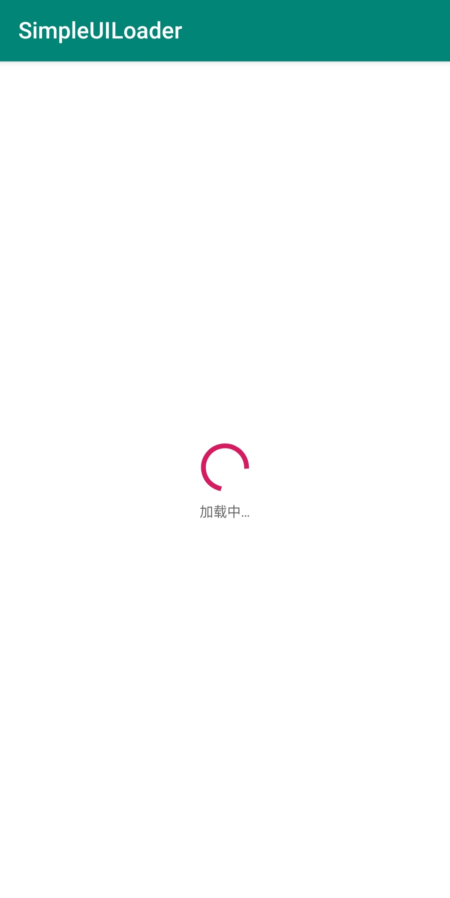
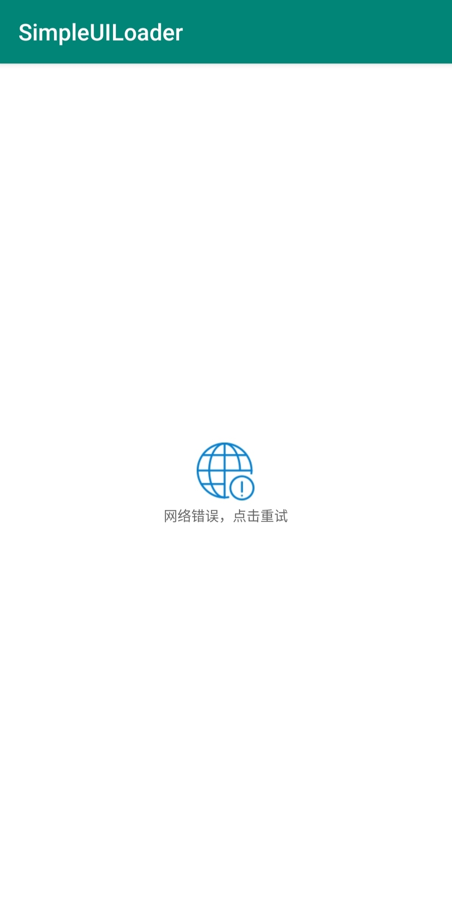
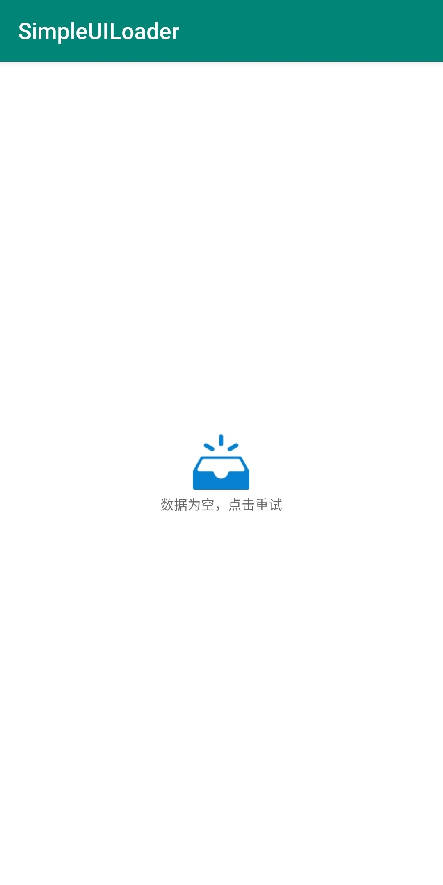

## SimpleUILoader

> 👷一个简单的UI状态加载器，包括加载中✈️、网络错误❌、空数据🈳️和加载成功👌

### 效果

|                      加载中                      |                       网络错误                       |                        数据为空                        |
| :----------------------------------------------: | :--------------------------------------------------: | :----------------------------------------------------: |
|  |  |  |

#### GiF展示


### 添加`SimpleUILoader`到你的项目

1. 在项目的 `build.gradle` 中添加：

```
allprojects {
    repositories {
	    ...
	    maven { url 'https://jitpack.io' }
    }
}
```

2. 添加依赖

```
dependencies {
    implementation 'com.github.plain-dev:SimpleUILoader:v1.0'
}
```

### 如何使用

1. 在布局中引入

```xml
<?xml version="1.0" encoding="utf-8"?>
<FrameLayout xmlns:android="http://schemas.android.com/apk/res/android"
    xmlns:app="http://schemas.android.com/apk/res-auto"
    xmlns:tools="http://schemas.android.com/tools"
    android:layout_width="match_parent"
    android:layout_height="match_parent"
    tools:context=".MainActivity">

    <!--加载完成后的View-->
    <LinearLayout
        android:layout_width="match_parent"
        android:layout_height="match_parent"
        android:orientation="vertical">

      ......
      
    </LinearLayout>

    <!--UILoader-->
    <com.plain.simpleuiloaderlib.SimpleUILoaderLayout
        android:id="@+id/ui_loader"
        android:layout_width="match_parent"
        android:layout_height="match_parent" />

</FrameLayout>
```

2. 在不同周期调用

```kotlin
//当加载成功时
ui_loader.notifyUIStatus(SUCCESS)
//当网络错误时
ui_loader.notifyUIStatus(NET_ERROR)
//当数据为空时
ui_loader.notifyUIStatus(DATA_EMPTY)
```

### 自定义布局

通过以下方式可以自定义布局

```xml
<com.plain.simpleuiloaderlib.SimpleUILoaderLayout
        android:id="@+id/ui_loader"
        android:layout_width="match_parent"
        android:layout_height="match_parent"
        app:dataEmptyLayout="@layout/layout_ui_status_data_empty"
        app:loadingLayout="@layout/layout_ui_status_loading"
        app:netErrorLayout="@layout/layout_ui_status_net_error" />
```

### 事件监听

当状态处于`网络错误`或`数据为空`时可以点击图标重新加载数据

```kotlin
ui_loader.setRefreshListener(object : SimpleUILoaderLayout.OnUIRefreshListener {
            override fun onRefresh(curStatus: UIStatus) {
                //在这里重新加载数据
            }
        })
```

⚠️ 当自定义布局时，这里发生点击事件的View的ID必须为`refresh`，像这样

```xml
<ImageView
     android:id="@+id/refresh"
     android:layout_width="50dp"
     android:layout_height="50dp"
     android:layout_gravity="center"
     android:src="@drawable/icon_data_empty"
     android:contentDescription="@string/str_data_empty" />
```

### 其它

1. 有问题欢迎提交`issure`

2. 状态图标来源[iconfont](https://www.iconfont.cn/)，侵删